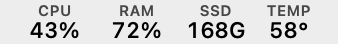
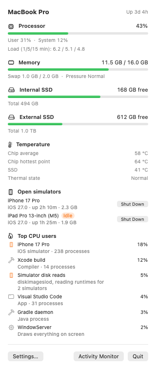

# Nabız

A small macOS menu bar monitor for CPU, memory, disk and temperature, built for developers who want to know *why* their Mac is busy, not just *that* it is. Free.

*Nabız* is Turkish for "pulse".

<picture>
  <source srcset="docs/screenshots/menubar-dark.png" media="(prefers-color-scheme: dark)">
  
</picture>

<picture>
  <source srcset="docs/screenshots/panel-dark.png" media="(prefers-color-scheme: dark)">
  
</picture>

## Download

**[Download Nabız for macOS](https://github.com/alicinaroglu/nabiz/releases/latest/download/Nabiz.dmg)**: open the disk image and drag Nabız to Applications. It is signed and notarized by Apple, opens at login, and updates itself.

Or with Homebrew:

```bash
brew install --cask alicinaroglu/tap/nabiz
```

Requires macOS 14 or later. Temperatures need Apple Silicon; everything else also works on Intel.

## What it shows

**In the menu bar:** CPU load, memory in use, free space on the internal disk, and chip temperature.

**In the panel:**

- CPU split into user and system time, plus the 1, 5 and 15 minute load averages
- Memory used (same formula as Activity Monitor), swap and memory pressure
- Free space on every local volume, external disks included
- Average and hottest chip temperature, SSD temperature, and the macOS thermal state
- Every booted simulator with its memory and uptime, a Shut Down button, and an "Idle" badge (plus an optional notification) when it has done nothing for a while
- The busiest processes, grouped by owner:
  - every process inside an iOS or tvOS simulator is grouped under that simulator's name, along with the disk image reads that feed it
  - app helpers are grouped under their app: "Code Helper (Plugin)" counts as Visual Studio Code, a virtual machine as the app that started it
  - Xcode builds, Gradle and Kotlin daemons, Maestro and Android emulators (with their AVD names) are named as such
  - common system services get a one-line explanation (`mds_stores`, `WindowServer`, `kernel_task` and others)

Settings choose the menu bar columns, free space or percent used for the disk, °C or °F, and the refresh interval. English and Turkish.

## Privacy

No analytics, no account. Temperatures are read directly from the chip's sensors, with no helper tool and no admin password. The only network request is the update check, which can be turned off in Settings.

## Feedback

Bug reports and ideas are welcome in [Issues](https://github.com/alicinaroglu/nabiz/issues).

## License

Nabız is free to use. Its source code is not public. See [LICENSE](LICENSE).
